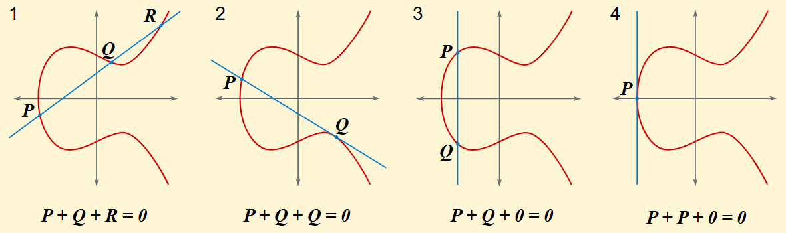

# Introduction
Elliptic Curves are defined by an equation, also known as the Weierstrass Equations  
$E: y^{2} = x^{3} + ax + b$  
However, in ECC, we treat valid curves as a set of points on a graph, we can define this as shown.  
$E(F_{p}) = (x, y): x, y ∈ F_{p}$ satisfying $y^{2} = x^{3} + ax +b ∪ O$  
This simply means that the "Elliptic Curve" that we are looking at contains points that have coordinates such that they are within the set $F_{p}$ that still satisfies the equation of the "curve" $y^{2} = x^{3} + ax + b$ + O at the point at infinity or the additive inverse.  

# Reduction/Trapdoor Function
The hardness of ECC comes from its reduction, where,  
Given points $Q, P$ find $n$ such that $Q = [n]P$  

# Identity Element
The identity element of an elliptic curve is the point O, where,  
$P + O = P$  
$P + (-P) = O$  
 
# Point Addition Properties
$P + O = O + P = P$  
$P + (- P) = O$  
$(P + Q) + R = P + (Q + R)$ (Associative)  
$P + Q = Q + P$ (Commutative)  

# Limitations
All elliptic curves in ECC must fulfil this equation $4a^{3} + 27b^{2} \neq 0$, this equation shows that the elliptic curve does not have a singularity point, meaning that there are no repeated roots for this equation, for reapeated roots can compromise the security of the ECC.  

# Point Negation
Point Negation is about calculating the inverse of a specific point on an ECC valid curve. To negate a point, we require its x and y coordinates and the modulus of the equation. We can do so using this equation:  
$P(x, y) = Q(x, p - y)$ -> $P + Q = O$  

# Point Addition
  
When we add 2 Points of a curve together $P + Q$ , we draw a line through Points P and Q intersecting the curve again at Point R. We then take the new point R prime such that it has the same coordinates as point R, however it has the coordinates $R(x, -y)$, where Point R prime is point R flipped along the x axis. We can say that $P + Q = R$ prime.  
If the 2 points are the same, $P + P$, we take the tangenet of the point, if the tangent intersects the curve again, we will do the same thing as with 2 different points. Call that point R and fliping it along the x axis.  
If the line does not intersect with the curve again, we say that it intersects with point O, which is a point located at the end of every line.  

### __Point Addition Formula__
Let there be $P(x_1, y_1)$ and $Q(x_2, y_2)$ and we want to calculate $P + Q$  
$-> If P = O, P + Q = Q$  
$-> If Q = O, P + Q = P$  
$If x_1 = x_2, y_1 = -y_2, P + Q = O$  
$If P \neq Q: \lambda = \frac{y_2 - y_1}{x_2 - x_1}$  
$If P = Q: \lambda = \frac{{3y^{2}}_{1} + a}{2y_1}$  
$x_3 = \lambda^2 - x_1 - x_2$  
$y_3 = \lambda(x_1 - x_3) - y_1$  
return $(x_3, y_3)$  

# Scalar Multiplication
Scalar Multiplication is the repeated addition of the same point n times; this is also the trapdoor function used for ECC. We are to find $n$ given $Q = [n]P$  
Input: $P ∈ E(F_p), n > 0$  
Output: $Q = [n]P ∈ E(F_p)$  
Let $-> Q = P, R = O$  
-> While $n > 0$  
If $n \equiv 1 \pmod{2}$ (n is odd) $-> R += Q$  
Let $Q = [2]Q, n = [n/2]$  
return $R = [n]P$  

# ECDLP
Given $Q, P$, find $n$ from $Q = [n]P$  
This is a hard search problem, meaning that it has no known algorithm to find a solution in polynomial time. This makes ECDLP the cornerstone of ECC, ensuring that ECC stays safe.  

# ECDHKE
The Elliptic Curve Diffie-Hellman Key Exchange is an algorithm that allows 2 individuals, Alice and Bob, to exchange secret keys through the use of Elliptic Curve Cryptography without having to meet up.  
Alice and Bob first agree on an $E$ curve, a prime modulo $p$ and a generator $G$, which generates a subgroup $H$ with order $q$, meaning that $G$ can generate $q$ points. Both Alice and Bob choose a private integer $n_A$ and $n_B$, respectively.  
Alice Calculates: $Q_A = [n_A]G$  
Bob Calculates: $Q_B = [n_B]G$  

They both send each other their calculated values, where Alice and Bob $Q_A$ and Bob sends Alice $Q_B$  
Alice Calculates: $[n_A]Q_B = SK$  
Bob Calculates: $[n_B]Q_A = SK$  

They both have a shared secret key due to the commutative properties of elliptic curve scalar multiplication and point addition.  
$S = [n_a]Q_B = [n_b]Q_A$  

If given only 1 coordinate, you can work backwards using the equation of elliptic curves. Usually, only the x coordinate will be sent, you can then use the above method to find y.  
Then you check both values of y mod p, the y with a parity bit (Odd) is the correct y, put it into scalar multiple and solve for shared x. The x value of S will usually be the shared key.  

# Montgomery’s Ladder
Montgomery’s Ladder, also known as Montgomery’s Binary Algorithm, is a secure method of calculating scalar multiples in elliptic curve cryptography. It protects the scalar calculation process from timing attacks, where the attacker gains useful information from knowing how long a certain operation takes to calculate.  

Input: $P ∈ E(F_p), k = \sum 2^{i} \cdot k_i, k_{n - 1} = 1$  
Output: $[k]P ∈ E(F_p)$  

$R_0, R_1 = P, [2]P$  
for i in range($n - 2$):  
  if $k_i = 0: R_0, R_1 = [2]R_0, R_0 + R_1$  
  else: $R_0, R_1 = R_0 + R_1, [2]R_0$  
return $R_0$  

This algorithm ensures that each time the coordinate is multiplied, it takes the same time by adding to itself and vice versa. This prevents timing attacks as addition is much faster than multiplication.  

# Pohlig-Hellman Algorithm
We want to find $n$ in:  
$Q = [n]G, [n]G ∈ {[0]G, [1]G, [2]G, [3]G,..., [q - 1]G}, |G| = q$  

This equation basically says that there are q number of valid generators $G$ and one of those values in the set $[n]G$ also means that $0 <= n < q$  
Since this equation is hard to brute-force and too time-consuming, we can split this group up into smaller parts with a smaller set of calculations.  
We do this by factoring $q$.  
 
$q = {p_1}^{e_1} \cdot {p_2}^{e_2} \cdot {p_3}^{e_3} .... {p_i}^{e_i}$  
$G_i = \frac{q}{{p_i}^{e_i}}G$  
$Q_i = \frac{q}{{p_i}^{e_i}}Q$  
$n_i = n \pmod{{p_i}^{e_i}}$  

We are then able to solve for n via brute force for an efficient algorithm, as the set of possible solutions has shrunk for each group.  
$Q_i = n_i \cdot G_i, n_i \cdot G_i ∈ {[0]G_i, [1]G_i, [2]G_i, [3]G_i,...,[{p_i}^{e_i}]G}$  

We can then find the discrete logarithm for all of these smaller subgroups and combine them using the Chinese Remainder Theorem  

In simple terms, this algorithm splits up a hard problem, or a problem with many solutions and turns it into multiple simple problems with very little solutions for each problem.  
Its like having a 10-digit lock with over $10^{10}$ possible combinations, using this algorithm to split this lock into 10 1-digit locks with 10 combinations each, greatly reducing the complexity and combining the lock at the end using the Chinese Remainder Theorem to get the full lock.  
You solve part of n for each small modulo p.  
This is only applicable if q is factorable, or if q is a smooth number  

# MOV Attack/Weil's Pairings
Add something about the MOV attack for ECC
