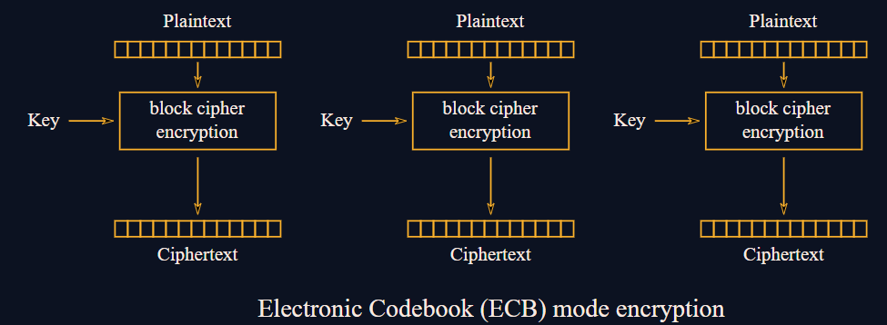
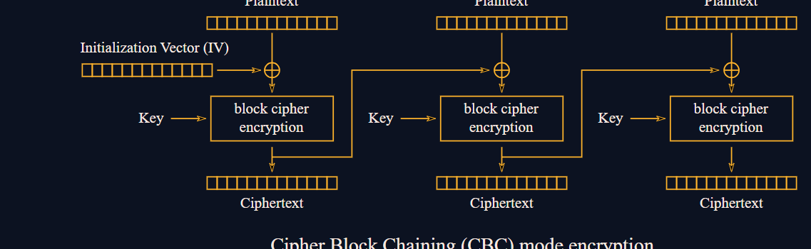
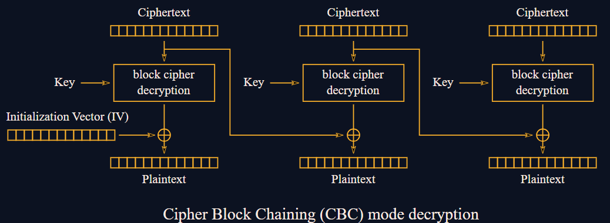
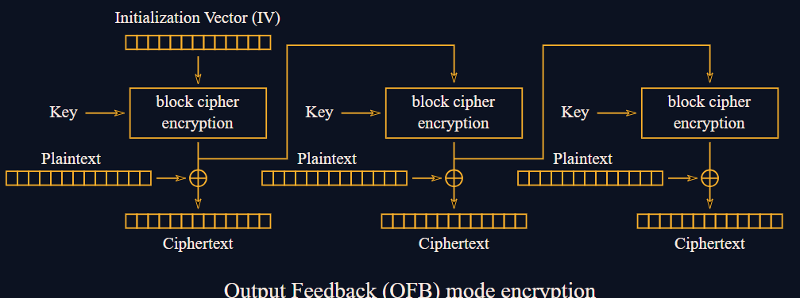
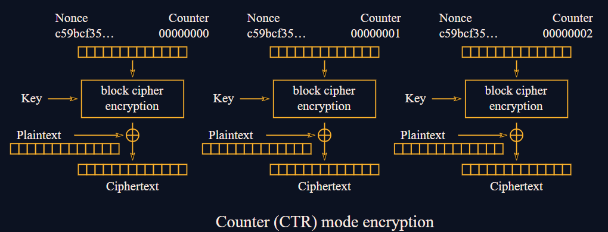

### __AES__

AES (Advanced Encryption Standard) is a symmetric block cipher designed to securely encrypt data in fixed-size blocks (128 bits). It uses keys of length 128, 192, or 256 bits and performs multiple rounds of transformations to convert plaintext into ciphertext.

Block Size and Key Length:

AES operates on 128-bit blocks arranged in a 4x4 matrix of bytes called the state.

Supported key lengths: 128-bit (10 rounds), 192-bit (12 rounds), 256-bit (14 rounds).

### __Key Expansion__

The original key is expanded into multiple round keys using a key schedule algorithm.

## __Initial Round__

AddRoundKey: XOR the plaintext state with the first round key.

Main Rounds (9, 11, or 13 rounds depending on key size):

SubBytes: Substitute each byte using a fixed S-box for non-linearity.

ShiftRows: Cyclically shift each row of the state matrix to the left by different offsets.

MixColumns: Mix bytes in each column via matrix multiplication over G(28)

AddRoundKey: XOR the current state with the round key.

Final Round (same as above but without MixColumns):

SubBytes → ShiftRows → AddRoundKey.

### __Pros of AES__

Strong Security: Resistant to known attacks like linear and differential cryptanalysis.

Efficiency: Designed for fast implementation in both hardware and software.

Flexibility: Supports multiple key sizes for varying security needs.

Standardisation: Globally recognised and widely used encryption standard.

Parallelizable: Several AES operations can be parallelised to enhance performance.

### __Cons of AES__

Block Size Limitation: A fixed block size of 128 bits can be limiting in some contexts.

Key Management: Like all symmetric ciphers, secure key distribution is crucial and challenging.

Complexity: The mathematical operations (especially MixColumns and key expansion) can be complex to implement.

Side-Channel Attacks: Vulnerable if physical implementations leak information (e.g. Timing attacks).

### __ECB__

What is ECB?

Electronic Codebook Mode, also known as ECB encryption, is a type of block cipher used for encryption. It is one of the weakest block encryption ciphers, as it is not very resistant to cryptoanalysis

ECB takes a key and another block cipher, encrypting every single block of the plaintext with the same key and cipher, concatenates them and outputs as ciphertext

ECB Advantages

Parallelisation: The Encryption and Decryption processes for all keys are efficient

Partial Perfect Secrecy: Perfect Secrecy can be achieved partially when pseudorandom keys are only used once for short messages

ECB Vulnerabilities

Diffusion and Confusion: ECB is very linear, making ECB such that there is little to no diffusion and confusion in ECB ciphers

Resistance to cryptoanalysis: Due to ECB’s nature, it is very vulnerable to cryptoanalysis as identical ciphertext blocks correspond to identical plaintext blocks.

How to break ECB?

Passive Analysis: Hackers can infer repeated plaintext blocks from repeated ciphertext blocks 

Frequency Analysis: Hackers can use common passwords from lists like rockyou.txt and infer which ciphertext blocks represent which block in plaintext

Chosen Plaintext Attacks: Hackers can use chosen plaintexts to know which ciphertext blocks refer to which plaintext block, using known inputs or controlled plaintexts.

One Byte at a Time: Hackers can use a chosen plaintext attack by slowly figuring out an important password or data by slowly changing their plaintext so that the returning ciphertext matches the important data/password.

### __CBC__

What is CBC?

Cipher Block Chaining is a block chain where the first block is XORed with the IV before being encrypted, the second block is XORed with the first encrypted block before being encrypted and so on.

CBC Advantages

Diffusion: All identical plaintext blocks do not produce identical ciphertext blocks, and all identical ciphertext blocks do not correspond to identical plaintext blocks

Decryption Efficiency: The decryption of CBC is parallelizable, making it efficient

CBC Vulnerabilities

Encryption Efficiency: The encryption process for CBC is not parallelizable, making the encryption process take a long time for long enough messages

Pseudorandom IVs: CBC requires the use of pseudorandom, unpredictable IVs to ensure its security

Predictability: The ciphertext can be manipulated predictably by modifying bits of the plaintext

How to break CBC?

IV Reuse Case: When an IV is reused, information about the relationships between plaintexts can be leaked

Bit flipping attacks: Hackers can flip bits in plaintext, changing the ciphertext’s bits in a predictable way

Padding Oracle Attacks: If the server acts differently when the padding is incorrect via timing attacks or error messages, the hacker can use this information and slowly change their plaintext to slowly find out the true plaintext

### __OFB__

What is OFB?

Output Feedback Mode, also known as OFB, is an algorithm used in block ciphers that transforms them into stream ciphers

OFB Advantages

Error Containment: Transmission errors or storage errors do not affect all of the stored data, and they do not affect other blocks

Bitwise Operations: OFB can be used on data smaller than desired blocks without padding, which allows data to be encrypted bit-wise

Parallizability: OFB is parallizable, allowing it to be more efficient in encryption and decryption

Resistance: As there is no decryption function for OFB, there are fewer methods of cryptoanalysis and cryptoattacks that can be done on OFB

OFB Vulnerabilities

Keystream Reuse: If IV is used for multiple messages, the ciphertexts can be XOR'd together to obtain plaintext.

Modification Attacks: OFB is more susceptible to target messages stream, where bit changes in ciphertexts are predictable from known plaintext bits

Short Cycles: For small blocks and repeated IV usage can cause plaintext to leak

How to break OFB?

Keystream Reuse Attacks: XORing ciphertexts that use the same IV can leak plaintext

Known IV and keystream: Allows you to decrypt other ciphertexts using the same IV and keystreams

Brute force: This only works on short ciphertexts

Short cycles: Allows attackers to spot repeated IV and keystream usage

### __CTR/GCM__

What is CTR?

Counter Mode, also known as CTR, encrypts a counter that increases in unknown increments and is then XORed with the plaintext to get the ciphertext

CTR Advantages

Parallizability: The encrypted counter can be processed in isolation, allowing for efficient encryption and decryption

Random Access: Each block is encrypted in isolation from another, allowing for direct access to a certain block without encrypting or decrypting other blocks

Simplicity: The encryption process is the same as the decryption process due to the XOR properties requiring only 1 function

Error Propagation: Errors only affect individual blocks and do not affect subsequent blocks

CTR Vulnerabilities

Counter Reuse: Reusing counters can lead to plaintext leakage

Counter Synchronisation: If counters are not in sync/kept properly, the decryption process will be very hard

Weak Counters: Predictable counters can lead to patterns in the keystream, compromising security

How to break CTR?

Keystream Reuse Attack: XORing ciphertexts with the same keystream can give the XOR of the plaintexts, allowing for potential attacks if 1 of the plaintexts is known

Known plaintext attack: Knowing part of a keystream can cause other ciphertexts that have the same keystream can be partially decrypted

Brute force: If counters are not large or random enough, the encryption parameters can be retrieved.
